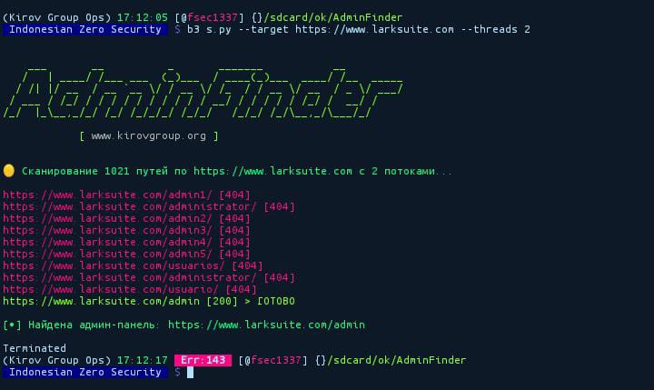

# AdminFinder 



Мощный многопоточный инструмент для поиска административных панелей, написанный на Python. Этот скрипт проверяет стандартные пути к админ-панелям на целевых сайтах с поддержкой прокси и ротацией User-Agent.

## Возможности

- 🚀 **Многопоточное сканирование** для быстрых результатов
- 🔒 **Поддержка прокси** (HTTP-прокси) для избежания блокировки IP
- 🕵️ **Ротация User-Agent** для обхода обнаружения
- 📁 **Загрузка списка путей из файла** (admin_list.txt)
- ⏱ **Обработка таймаутов** для стабильного сканирования

## Требования

- Python 3.6+
- pip 20.0+
- Необходимые пакеты: `requests`, `colorama`, `argparse`

## Установка

1. Клонируйте репозиторий:
```bash
git clone https://github.com/FreedomSec1337/AdminFinder
cd AdminFinder
```

2. Установите зависимости:
```bash
pip install -r r
```

## Использование

Базовое использование:
```bash
python3 njir.py --target http://example.com
```

С указанием потоков и прокси:
```bash
python3 njir.py --target http://example.com --threads 20 --proxy proxies.txt
```

### Аргументы

| Аргумент   | Описание                          | По умолчанию |
|------------|--------------------------------------|---------|
| --target   | Целевой URL (обязательно)          | -       |
| --threads  | Количество потоков                 | 10      |
| --proxy    | Файл со списком прокси (опционально)| -       |

## Структура файлов

- `njir.py` - Основной скрипт
- `admin_list.txt` - Содержит стандартные пути к админ-панелям
- `proxy.txt` - Пример файла с прокси (создайте свой)

## Разработчик

**./Freedom Security**  
🌐 [www.kirovgroup.org](http://www.kirovgroup.org)  
📧 fsec@izsgroup.id  

## Версии Python и PIP

Для работы скрипта требуется:
- Python 3.6 или выше
- PIP 20.0 или выше

Проверьте свои версии:
```bash
python --version
pip --version
```

## Пример запуска

```bash
python njir.py --target http://testphp.vulnweb.com --threads 15
```

Пример вывода:
```
[•] Сканирование 100 путей на http://testphp.vulnweb.com с 15 потоками...
http://testphp.vulnweb.com/panel [404]
http://testphp.vulnweb.com/login [404]
http://testphp.vulnweb.com/admin [200] > НАЙДЕНО

 [404]

[•] Админ-панель найдена: http://testphp.vulnweb.com/admin
```

## Участие в разработке

Приветствуются pull requests. Для значительных изменений сначала создайте issue, чтобы обсудить предлагаемые изменения.

## Лицензия

[MIT](https://choosealicense.com/licenses/mit/)
